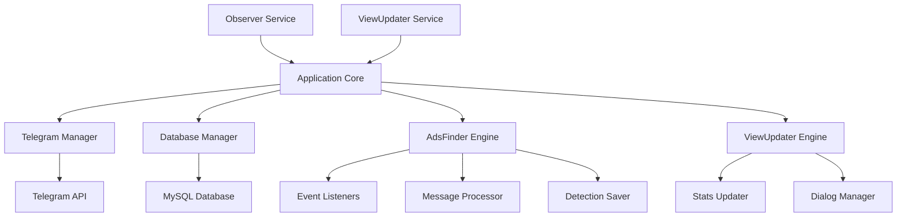

# 🔍 TgObserver - سیستم هوشمند رصد تبلیغات تلگرام

<div align="center">


سیستم حرفه‌ای شناسایی و ردیابی تبلیغات فوروارد شده در کانال‌های تلگرام با قابلیت بروزرسانی خودکار آمار

[نصب سریع](#-نصب-سریع) • [راهنما](#-راهنمای-استفاده) • [Docker](#-اجرا-با-docker) • [API Docs](#-api-reference)

</div>

---

## 📑 فهرست مطالب

- [ویژگی‌ها](#-ویژگیها)
- [معماری پروژه](#-معماری-پروژه)
- [ساختار فایل‌ها](#-ساختار-فایلها)
- [پیش‌نیازها](#-پیشنیازها)
- [نصب سریع](#-نصب-سریع)
- [پیکربندی](#-پیکربندی)
- [راهنمای استفاده](#-راهنمای-استفاده)
- [اجرا با Docker](#-اجرا-با-docker)
- [اجرا با PM2](#-اجرا-با-pm2)
- [دیتابیس](#-دیتابیس)
- [API Reference](#-api-reference)
- [مانیتورینگ](#-مانیتورینگ)
- [عیب‌یابی](#-عیبیابی)
- [نمونه پیام‌ها](#-نمونه-پیامها)
- [توسعه](#-توسعه)
- [مشارکت](#-مشارکت)

---

## ✨ ویژگی‌ها

### 🎯 قابلیت‌های اصلی
- **شناسایی خودکار تبلیغات** - تشخیص Real-time پست‌های تبلیغاتی فوروارد شده
- **بروزرسانی آمار** - آپدیت خودکار View و Forward هر 15 دقیقه
- **گزارش‌دهی تلگرام** - ارسال گزارش‌های لحظه‌ای به ادمین
- **مدیریت خودکار خطا** - Restart خودکار و Health Check منظم

### 🌟 ویژگی‌های پیشرفته
- **اطلاعات کامل کانال** - نمایش Username، نام، وضعیت عمومی/خصوصی
- **زمان ایران** - نمایش تمام زمان‌ها به وقت تهران
- **کش هوشمند** - Cache برای Query های تکراری
- **Connection Pool** - مدیریت بهینه اتصالات دیتابیس
- **Memory Management** - پاکسازی خودکار حافظه
- **Rate Limiting** - جلوگیری از Flood در Telegram API

---

## 🏗 معماری پروژه



### 🔄 Data Flow

1. **Observer Flow:**
   ```
   New Message → Event Handler → Check Forward → Database Query → 
   Detection Found → Save to DB → Notify Admin
   ```

2. **ViewUpdater Flow:**
   ```
   Timer (15min) → Get Detections → Check Membership → 
   Get Stats → Update Database → Report to Admin
   ```

---

## 📁 ساختار فایل‌ها

```
TgObserver/
│
├── 📁 Services/                    # سرویس‌های اصلی
│   ├── 📄 observer.js              # سرویس مانیتورینگ کانال‌ها
│   └── 📄 viewUpdater.js           # سرویس بروزرسانی آمار
│
├── 📁 src/
│   └── 📁 Core/                    # هسته اپلیکیشن
│       ├── 📄 config.js            # مدیریت تنظیمات
│       ├── 📄 Application.js       # کلاس اصلی اپلیکیشن
│       ├── 📄 telegramManager.js   # مدیریت اتصال تلگرام
│       ├── 📄 AdsFinder.js         # موتور شناسایی تبلیغات
│       └── 📄 ViewUpdater.js       # موتور بروزرسانی آمار
│
├── 📁 database/
│   └── 📄 database.js              # Connection Pool و Query Manager
│
├── 📁 Scripts/                     # اسکریپت‌های کمکی
│   └── 📄 create-sessions.js      # ایجاد Session تلگرام
│
├── 📁 sessions/                    # فایل‌های Session (ایجاد خودکار)
├── 📁 logs/                        # لاگ‌های سیستم (ایجاد خودکار)
│
├── 📄 .env.observer                # تنظیمات Observer
├── 📄 .env.viewupdater             # تنظیمات ViewUpdater
├── 📄 .env.example                 # نمونه فایل تنظیمات
├── 📄 package.json                 # وابستگی‌ها و اسکریپت‌ها
├── 📄 ObserverDockerfile           # Docker image Observer
├── 📄 ViewUpdaterDockerfile        # Docker image ViewUpdater
├── 📄 docker-compose.yml           # Docker Compose config
└── 📄 README.md                    # این فایل
```

---

## 📋 پیش‌نیازها

### نرم‌افزارهای مورد نیاز
- **Node.js** v16.0.0 یا بالاتر
- **MySQL** 5.7 یا بالاتر / MariaDB 10.3+
- **Git** (برای clone کردن)

### دسترسی‌های مورد نیاز
- **Telegram API** از [my.telegram.org](https://my.telegram.org)
- **MySQL Database** با دسترسی کامل
- **حداقل RAM:** 512MB (توصیه شده: 1GB)
- **فضای دیسک:** 500MB

---

## 🚀 نصب سریع

### 1️⃣ Clone و نصب
```bash
# Clone repository
git clone https://github.com/yourusername/TgObserver.git
cd TgObserver

# نصب dependencies
npm install

# ایجاد پوشه‌های مورد نیاز
mkdir -p logs sessions
```

### 2️⃣ تنظیمات سریع
```bash
# کپی فایل‌های تنظیمات
درصورتی که میخواهید فایل های تنظیمات هربخش جدا باشد
 از کد زیر استفاده کنید و آدرس فایل تنظیمات را در کد جابه جا کنید(در غیر این صورت  میتوانید در دو نسخه جدا آن هارا ران کنید)
cp .env.example .env.observer
cp .env.example .env.viewupdater

# ویرایش تنظیمات
nano .env.observer
nano .env.viewupdater
```

### 3️⃣ ایجاد Session
```bash
node Scripts/create-sessions.js
# انتخاب کنید: 1 (Observer), 2 (ViewUpdater), یا 3 (هر دو)
```

### 4️⃣ اجرا
```bash
# Observer
node Services/observer.js

# ViewUpdater (در ترمینال جدید)
node Services/viewUpdater.js
```

---

## ⚙ پیکربندی

### 📝 فایل .env.observer

```env
# === Telegram Configuration ===
API_ID=12345678                     # از my.telegram.org
API_HASH=your_api_hash_here         # از my.telegram.org
SESSION_PATH=./sessions/observer_session.txt
ADMIN_USERNAME=@YourUsername        # برای دریافت گزارش‌ها

# === Database Configuration ===
DB_HOST=localhost                   # آدرس دیتابیس
DB_PORT_WRITE=3306                  # پورت MySQL
DB_USER=root                        # یوزرنیم دیتابیس
DB_PASS=yourpassword                # پسورد دیتابیس
DB_NAME=telegram_db                 # نام دیتابیس

# === Service Configuration ===
SERVICE_NAME=observer               # نام سرویس
LOG_LEVEL=INFO                      # ERROR, WARN, INFO, DEBUG
NODE_ENV=production                 # development, production
```

### 📝 فایل .env.viewupdater

```env
# === Telegram Configuration ===
API_ID=87654321                     # می‌تواند متفاوت از Observer باشد
API_HASH=another_api_hash           
SESSION_PATH=./sessions/viewupdater_session.txt
ADMIN_USERNAME=@YourUsername        

# === Database Configuration ===
DB_HOST=localhost                   
DB_PORT_WRITE=3306                  
DB_USER=root                        
DB_PASS=yourpassword                
DB_NAME=telegram_db                 

# === Service Configuration ===
SERVICE_NAME=viewupdater            
UPDATE_INTERVAL=15                  # فاصله بروزرسانی (دقیقه)
LOG_LEVEL=INFO                      
NODE_ENV=production                 
```

### 📊 سطوح LOG_LEVEL

| سطح | توضیح | کاربرد |
|-----|-------|--------|
| `ERROR` | فقط خطاهای بحرانی | Production |
| `WARN` | خطاها + هشدارها | Production با مانیتورینگ |
| `INFO` | خطاها + هشدارها + اطلاعات مهم | Development |
| `DEBUG` | همه لاگ‌ها با جزئیات کامل | Debugging |

---

## 📖 راهنمای استفاده

### 🎯 اجرای مستقیم

```bash
# Terminal 1 - Observer
node Services/observer.js

# Terminal 2 - ViewUpdater
node Services/viewUpdater.js
```

### 🔧 با npm scripts

در `package.json` اضافه کنید:
```json
{
  "scripts": {
    "observer": "node Services/observer.js",
    "viewupdater": "node Services/viewUpdater.js",
    "start": "npm run observer & npm run viewupdater"
  }
}
```

اجرا:
```bash
npm run observer
npm run viewupdater
```

---

## 🐳 اجرا با Docker

### 📦 Build Images

**ObserverDockerfile:**
```dockerfile
FROM node:18
WORKDIR /app
COPY package*.json ./
RUN npm install --production
COPY . .
COPY .env.observer .env
RUN mkdir -p logs sessions
CMD ["node", "Services/observer.js"]
```

**ViewUpdaterDockerfile:**
```dockerfile
FROM node:18
WORKDIR /app
COPY package*.json ./
RUN npm install --production
COPY . .
COPY .env.viewupdater .env
RUN mkdir -p logs sessions
CMD ["node", "Services/viewUpdater.js"]
```

### 🚢 Build و Run

```bash
# Build images
docker build -t tg-observer -f ObserverDockerfile .
docker build -t tg-viewupdater -f ViewUpdaterDockerfile .

# Run Observer
docker run -d \
  --name observer \
  -v $(pwd)/sessions:/app/sessions \
  -v $(pwd)/logs:/app/logs \
  --restart unless-stopped \
  tg-observer

# Run ViewUpdater
docker run -d \
  --name viewupdater \
  -v $(pwd)/sessions:/app/sessions \
  -v $(pwd)/logs:/app/logs \
  --restart unless-stopped \
  tg-viewupdater
```

### 📝 Docker Compose

**docker-compose.yml:**
```yaml
version: '3.8'

services:
  mysql:
    image: mysql:8.0
    container_name: tg-mysql
    environment:
      MYSQL_ROOT_PASSWORD: rootpass
      MYSQL_DATABASE: telegram_db
      MYSQL_USER: tguser
      MYSQL_PASSWORD: tgpass
    volumes:
      - mysql_data:/var/lib/mysql
      - ./init.sql:/docker-entrypoint-initdb.d/init.sql
    ports:
      - "3306:3306"
    restart: unless-stopped

  observer:
    build:
      context: .
      dockerfile: ObserverDockerfile
    container_name: tg-observer
    volumes:
      - ./sessions:/app/sessions
      - ./logs/observer:/app/logs
    environment:
      DB_HOST: mysql
    depends_on:
      - mysql
    restart: unless-stopped

  viewupdater:
    build:
      context: .
      dockerfile: ViewUpdaterDockerfile
    container_name: tg-viewupdater
    volumes:
      - ./sessions:/app/sessions
      - ./logs/viewupdater:/app/logs
    environment:
      DB_HOST: mysql
    depends_on:
      - mysql
    restart: unless-stopped

volumes:
  mysql_data:
```

### 🎮 Docker Commands

```bash
# شروع همه سرویس‌ها
docker-compose up -d

# مشاهده لاگ‌ها
docker-compose logs -f
docker logs -f observer
docker logs -f viewupdater

# توقف سرویس‌ها
docker-compose down

# ری‌استارت
docker-compose restart

# مشاهده وضعیت
docker ps
docker stats
```

---

## 🔥 اجرا با PM2

### نصب PM2
```bash
npm install -g pm2
```

### شروع سرویس‌ها

```bash
# Observer با تنظیمات کامل
pm2 start Services/observer.js \
  --name "tg-observer" \
  --max-memory-restart 800M \
  --log logs/observer.log \
  --error logs/observer-error.log \
  --time \
  --restart-delay 5000

# ViewUpdater با تنظیمات کامل
pm2 start Services/viewUpdater.js \
  --name "tg-viewupdater" \
  --max-memory-restart 600M \
  --log logs/viewupdater.log \
  --error logs/viewupdater-error.log \
  --time \
  --restart-delay 5000
```

### ecosystem.config.js (اختیاری)

```javascript
module.exports = {
  apps: [
    {
      name: 'tg-observer',
      script: './Services/observer.js',
      instances: 1,
      autorestart: true,
      watch: false,
      max_memory_restart: '800M',
      env: {
        NODE_ENV: 'production'
      },
      error_file: './logs/observer-error.log',
      out_file: './logs/observer-out.log',
      log_file: './logs/observer-combined.log',
      time: true,
      restart_delay: 5000,
      kill_timeout: 10000
    },
    {
      name: 'tg-viewupdater',
      script: './Services/viewUpdater.js',
      instances: 1,
      autorestart: true,
      watch: false,
      max_memory_restart: '600M',
      env: {
        NODE_ENV: 'production'
      },
      error_file: './logs/viewupdater-error.log',
      out_file: './logs/viewupdater-out.log',
      log_file: './logs/viewupdater-combined.log',
      time: true,
      restart_delay: 5000
    }
  ]
};
```

### PM2 Commands

```bash
# مدیریت پایه
pm2 start ecosystem.config.js    # شروع با فایل config
pm2 status                       # وضعیت سرویس‌ها
pm2 list                         # لیست پروسس‌ها
pm2 monit                        # مانیتور تعاملی

# لاگ‌ها
pm2 logs                         # همه لاگ‌ها
pm2 logs tg-observer            # لاگ Observer
pm2 logs --lines 100            # 100 خط آخر

# کنترل سرویس‌ها
pm2 restart all                  # ری‌استارت همه
pm2 restart tg-observer          # ری‌استارت Observer
pm2 stop all                     # توقف همه
pm2 delete all                   # حذف از لیست

# ذخیره و بازیابی
pm2 save                         # ذخیره وضعیت فعلی
pm2 resurrect                    # بازیابی وضعیت

# Startup (راه‌اندازی خودکار)
pm2 startup                      # تولید اسکریپت startup
pm2 unstartup                    # حذف startup
```

---

## 💾 دیتابیس

### ساختار جداول

```sql
CREATE DATABASE IF NOT EXISTS telegram_db;
USE telegram_db;

-- جدول کمپین‌ها
CREATE TABLE IF NOT EXISTS campaigns (
    id INT PRIMARY KEY AUTO_INCREMENT,
    name VARCHAR(255),
    status ENUM('ON_GOING', 'SHOT', 'PAUSE', 'ENDED'),
    medium ENUM('TELEGRAM', 'OTHER'),
    created_at TIMESTAMP DEFAULT CURRENT_TIMESTAMP
);

-- جدول رسانه‌ها (کانال‌ها)
CREATE TABLE IF NOT EXISTS media (
    id INT PRIMARY KEY AUTO_INCREMENT,
    mediaIdentifier VARCHAR(255),
    username VARCHAR(255),
    privacy VARCHAR(50),
    medium ENUM('TELEGRAM', 'OTHER'),
    created_at TIMESTAMP DEFAULT CURRENT_TIMESTAMP
);

-- جدول لیست تبلیغات
CREATE TABLE IF NOT EXISTS pushList (
    id INT PRIMARY KEY AUTO_INCREMENT,
    campaignId INT,
    mediaId INT,
    contentId INT,
    status ENUM('APPROVED', 'DETECTED', 'PENDING'),
    editedChannelId VARCHAR(255),
    editedMessageIds TEXT,
    created_at TIMESTAMP DEFAULT CURRENT_TIMESTAMP,
    FOREIGN KEY (campaignId) REFERENCES campaigns(id),
    FOREIGN KEY (mediaId) REFERENCES media(id)
);

-- جدول محتوا
CREATE TABLE IF NOT EXISTS contents (
    id INT PRIMARY KEY AUTO_INCREMENT,
    channelId VARCHAR(255),
    messageId VARCHAR(255),
    forwardFromChannelId VARCHAR(255),
    forwardFromMessageId VARCHAR(255),
    created_at TIMESTAMP DEFAULT CURRENT_TIMESTAMP
);

-- جدول ارتباط کمپین و محتوا
CREATE TABLE IF NOT EXISTS campaignContents (
    id INT PRIMARY KEY AUTO_INCREMENT,
    campaignId INT,
    contentId INT,
    created_at TIMESTAMP DEFAULT CURRENT_TIMESTAMP,
    FOREIGN KEY (campaignId) REFERENCES campaigns(id),
    FOREIGN KEY (contentId) REFERENCES contents(id)
);

-- جدول شناسایی‌ها
CREATE TABLE IF NOT EXISTS detections (
    id INT PRIMARY KEY AUTO_INCREMENT,
    type ENUM('PLACEMENT', 'REMOVE'),
    pushId INT,
    postId VARCHAR(255),
    actionTime BIGINT,
    finder VARCHAR(255),
    created_at TIMESTAMP DEFAULT CURRENT_TIMESTAMP,
    FOREIGN KEY (pushId) REFERENCES pushList(id)
);

-- جدول تاریخچه آمار
CREATE TABLE IF NOT EXISTS insightHistories (
    id INT PRIMARY KEY AUTO_INCREMENT,
    pushId INT,
    viewCount INT DEFAULT 0,
    share INT DEFAULT 0,
    created_at TIMESTAMP DEFAULT CURRENT_TIMESTAMP,
    FOREIGN KEY (pushId) REFERENCES pushList(id)
);

-- ایندکس‌ها برای بهبود Performance
CREATE INDEX idx_pushList_status ON pushList(status);
CREATE INDEX idx_campaigns_status ON campaigns(status);
CREATE INDEX idx_detections_pushId ON detections(pushId);
CREATE INDEX idx_detections_type ON detections(type);
CREATE INDEX idx_media_identifier ON media(mediaIdentifier);
CREATE INDEX idx_insights_pushId ON insightHistories(pushId);
```

### Backup & Restore

```bash
# Backup
mysqldump -u root -p telegram_db > backup_$(date +%Y%m%d).sql

# Restore
mysql -u root -p telegram_db < backup_20240101.sql

# Backup with Docker
docker exec tg-mysql mysqldump -u root -prootpass telegram_db > backup.sql
```

---

## 📡 API Reference

### AdsFinder Methods

| Method | Description | Parameters | Returns |
|--------|-------------|------------|---------|
| `start()` | شروع مانیتورینگ | - | Promise<void> |
| `stop()` | توقف مانیتورینگ | - | Promise<void> |
| `notifyAdmin(message)` | ارسال پیام به ادمین | message: string | Promise<void> |
| `getStats()` | دریافت آمار | - | Object |
| `checkForwardedMessage(info)` | بررسی forward | info: Object | Promise<Object> |

### ViewUpdater Methods

| Method | Description | Parameters | Returns |
|--------|-------------|------------|---------|
| `start()` | شروع بروزرسانی | - | Promise<void> |
| `stop()` | توقف بروزرسانی | - | Promise<void> |
| `performUpdate()` | اجرای بروزرسانی | - | Promise<Object> |
| `setUpdateInterval(minutes)` | تغییر فاصله بروزرسانی | minutes: number | boolean |
| `getStats()` | دریافت آمار | - | Object |

---

## 📊 مانیتورینگ

### لاگ‌های Real-time

```bash
# فایل‌های لاگ
tail -f logs/observer-*.log
tail -f logs/viewupdater-*.log

# PM2 logs
pm2 logs --lines 50
pm2 logs tg-observer --err

# Docker logs
docker logs -f observer --tail 100
docker logs -f viewupdater --since 1h
```

### Metrics & Stats

```bash
# PM2 monitoring
pm2 monit                    # Interactive dashboard
pm2 info tg-observer         # Detailed info
pm2 describe tg-observer     # Full description

# Docker stats
docker stats                 # Resource usage
docker inspect observer      # Container details
```

### Health Checks

```bash
# Check if services are running
ps aux | grep -E "observer|viewupdater"

# Check ports
netstat -tuln | grep 3306   # MySQL

# Check disk space
df -h logs/

# Check memory
free -m
```

---

## 🔧 عیب‌یابی

### مشکلات رایج و راه‌حل

#### 1️⃣ Session Expired
```bash
# حذف session قدیمی
rm sessions/*.txt

# ایجاد session جدید
node Scripts/create-sessions.js
```

#### 2️⃣ Database Connection Failed
```bash
# چک MySQL service
sudo systemctl status mysql
sudo systemctl restart mysql

# تست اتصال
mysql -u root -p -e "SELECT 1"

# چک تنظیمات
cat .env.observer | grep DB_
```

#### 3️⃣ High Memory Usage
```bash
# PM2
pm2 restart tg-observer --max-memory-restart 500M

# Docker
docker update --memory="500m" observer
docker restart observer
```

#### 4️⃣ API Rate Limit
```env
# در .env کاهش دهید
UPDATE_INTERVAL=30  # از 15 به 30 دقیقه
```

#### 5️⃣ Not Member of Channel
- به کانال‌های گزارش شده join کنید
- یا از لیست pushList حذف کنید

### Debug Mode

```env
# در .env فعال کنید
LOG_LEVEL=DEBUG
NODE_ENV=development
```

```javascript
// در کد اضافه کنید
console.log('Debug:', variable);
console.trace('Stack trace');
```

---

## 📱 نمونه پیام‌ها

### پیام شناسایی تبلیغ
```
🎯 تبلیغ شناسایی شد!

📊 اطلاعات کمپین:
• نام: کمپین زمستانه
• Push ID: 12345

📍 محل قرارگیری:
• کانال: @techChannel
• نام کانال: کانال تکنولوژی
• وضعیت: 🌐 عمومی
• تعداد اعضا: ۱۵,۵۰۰
• شماره پیام: 5678
• زمان: ۱۴۰۳/۱۰/۰۵ - ۱۴:۳۰:۴۵

📈 آمار:
• بازدید: ۳,۴۵۶
• فوروارد: ۶۷

🔗 منبع:
• از کانال: 1234567890
• پیام شماره: 234

🔍 لینک مستقیم:
https://t.me/techChannel/5678
```

### گزارش بروزرسانی
```
📊 بروزرسانی View/Forward

• ✅ بروزرسانی موفق: 67
• ❌ خطاها: 3
• ⏱️ مدت زمان: 34 ثانیه
• 📝 کل بروزرسانی‌ها: 234

⚠️ کانال‌های غیرعضو (5):
• -1001234567890 (@channel1)
  کمپین: بهاره
  تعداد Push: 3

• -1009876543210
  کمپین: تابستانه
  تعداد Push: 2

🔔 لطفاً در این کانال‌ها عضو شوید.

🕐 زمان: ۱۴۰۳/۱۰/۰۵ - ۱۵:۴۵:۳۰
```

### گزارش روزانه
```
📊 گزارش روزانه

• مدت زمان اجرا: 23 ساعت و 45 دقیقه
• پیام‌های پردازش شده: ۴۵,۶۷۸
• تبلیغات شناسایی شده (کل): ۲۳۴
• تبلیغات شناسایی شده (امروز): ۴۵
• مصرف حافظه: 234 MB
• اندازه کش: 89
• زمان: ۱۴۰۳/۱۰/۰۵ - ۲۳:۵۹:۰۰
• وضعیت: ✅ فعال
```

---

## 🛠 توسعه

### اضافه کردن Feature جدید

1. **ایجاد فایل جدید در `src/Core/`**
```javascript
// src/Core/MyFeature.js
class MyFeature {
    constructor(telegram, database) {
        this.telegram = telegram;
        this.database = database;
    }
    
    async doSomething() {
        // کد شما
    }
}

module.exports = MyFeature;
```

2. **اضافه کردن به Application.js**
```javascript
const MyFeature = require('./MyFeature');

class Application {
    async initialize() {
        // ...
        this.myFeature = new MyFeature(this.telegram, this.database);
    }
}
```

### تغییر زمان بروزرسانی

در `.env.viewupdater`:
```env
UPDATE_INTERVAL=30  # تغییر به 30 دقیقه
```

یا در `ViewUpdater.js`:
```javascript
this.intervalMinutes = 30;  // به جای 15
```

### اضافه کردن Log Level جدید

```javascript
// در فایل مورد نظر
const LOG_LEVELS = {
    TRACE: 0,
    DEBUG: 1,
    INFO: 2,
    WARN: 3,
    ERROR: 4,
    FATAL: 5
};

function log(level, message) {
    const currentLevel = LOG_LEVELS[process.env.LOG_LEVEL] || 2;
    if (LOG_LEVELS[level] >= currentLevel) {
        console.log(`[${level}] ${message}`);
    }
}
```

---

## 🤝 مشارکت

### چگونه مشارکت کنیم؟

1. **Fork** کنید
2. **Branch** بسازید (`git checkout -b feature/AmazingFeature`)
3. **Commit** کنید (`git commit -m 'Add some AmazingFeature'`)
4. **Push** کنید (`git push origin feature/AmazingFeature`)
5. **Pull Request** باز کنید

### قوانین کد

- استفاده از `async/await` به جای callbacks
- نام‌گذاری camelCase برای متغیرها
- نام‌گذاری PascalCase برای کلاس‌ها
- کامنت‌گذاری برای توابع پیچیده
- Error handling با try/catch

---

## 📄 لایسنس

این پروژه تحت لایسنس [MIT](LICENSE) منتشر شده است.

---

## 👥 تیم توسعه

- **توسعه‌دهنده اصلی** - [Your Name](https://github.com/yourusername)
- **مشارکت‌کنندگان** - [Contributors](https://github.com/yourusername/TgObserver/contributors)

---

## 📞 پشتیبانی

- **Issues:** [GitHub Issues](https://github.com/yourusername/TgObserver/issues)
- **Email:** support@example.com
- **Telegram:** [@YourSupportBot](https://t.me/YourSupportBot)

---

<div align="center">

ساخته شده با ❤️ و ☕

⭐ اگر این پروژه مفید بود، ستاره بدهید!

</div>